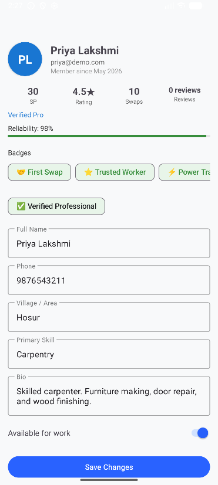
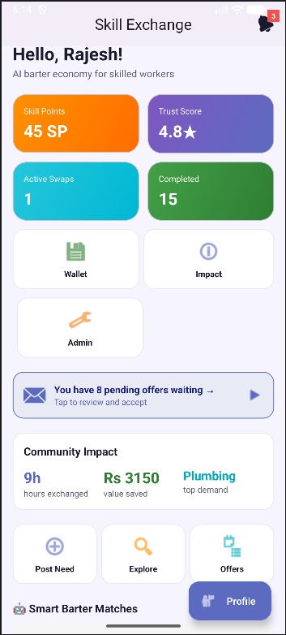
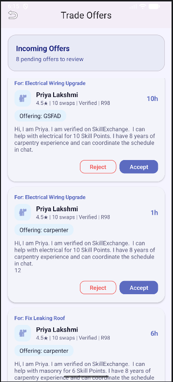
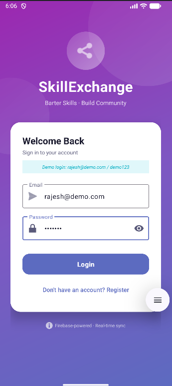

# 🤝 SkillExchange – Barter-Based Skill Sharing Android App

[](https://android.com)
[](https://kotlinlang.org)
[](https://firebase.google.com)
[](https://developer.android.com/training/data-storage/room)
[](https://developer.android.com/topic/architecture)
[](LICENSE)

---

## 📌 Problem Statement

In today's world, people possess a wide range of skills — coding, music, design, language, cooking — but lack a structured platform to **exchange** those skills without monetary transactions. Traditional learning platforms are expensive and inaccessible to many. **SkillExchange** solves this by enabling a **barter economy for knowledge**: you teach what you know, and learn what you need — for free.

---

## 🌟 Key Features

| Feature | Description |
|---|---|
| 🔐 **Firebase Authentication** | Secure email/password login and registration |
| 📋 **Skill Board** | Post skills you can offer and needs you want fulfilled |
| 🔁 **Barter Swap System** | Propose, accept, reject, and track skill swaps |
| 💬 **Real-time Chat** | Message other users directly within a swap |
| 🧠 **AI Match Suggestions** | Smart barter matching engine with compatibility scoring |
| 🏆 **Trust Score & Gamification** | Reputation system with badges and skill points |
| 👛 **Skill Wallet** | Track earned and spent skill points per transaction |
| 🔔 **Notifications** | Real-time alerts for swap requests and messages |
| 📊 **Dashboard** | Live stats — active swaps, trust score, recent activity |
| 🛡️ **Admin Panel** | Moderate users, verify skills, handle reports |
| 📈 **Impact Metrics** | Track community-wide learning impact |
| 🌙 **Dark/Light Theme** | Material You design with dynamic theming |

---

## 🛠️ Tech Stack

| Layer | Technology |
|---|---|
| **Language** | Kotlin 100% |
| **Platform** | Android (minSdk 26, targetSdk 36) |
| **UI** | XML Layouts + Material Design 3 + View Binding |
| **Architecture** | MVVM + Repository Pattern |
| **Local DB** | Room (SQLite) with 14 entities |
| **Cloud Backend** | Firebase Firestore + Firebase Realtime Database |
| **Authentication** | Firebase Auth |
| **Navigation** | Android Navigation Component |
| **Async** | Kotlin Coroutines + LiveData |
| **Build System** | Gradle (Kotlin DSL) |

---

## 📂 Project Structure

```
SkillExchange-app/
├── app/
│   ├── src/
│   │   └── main/
│   │       ├── java/com/example/skillexchangeapp/
│   │       │   ├── MainActivity.kt               # Entry point & nav host
│   │       │   ├── SkillExchangeApplication.kt   # App-level init
│   │       │   ├── ui/
│   │       │   │   ├── fragment/                 # 17 screen fragments
│   │       │   │   │   ├── LoginFragment.kt
│   │       │   │   │   ├── RegisterFragment.kt
│   │       │   │   │   ├── DashboardFragment.kt
│   │       │   │   │   ├── OfferFragment.kt
│   │       │   │   │   ├── NeedFeedFragment.kt
│   │       │   │   │   ├── SwapManagementFragment.kt
│   │       │   │   │   ├── ChatFragment.kt
│   │       │   │   │   ├── ProfileFragment.kt
│   │       │   │   │   ├── WalletFragment.kt
│   │       │   │   │   ├── NotificationFragment.kt
│   │       │   │   │   ├── AdminFragment.kt
│   │       │   │   │   ├── ImpactFragment.kt
│   │       │   │   │   ├── HistoryFragment.kt
│   │       │   │   │   ├── PostNeedFragment.kt
│   │       │   │   │   ├── OfferManagementFragment.kt
│   │       │   │   │   ├── SettingsFragment.kt
│   │       │   │   │   └── SplashFragment.kt
│   │       │   │   ├── adapter/                  # RecyclerView adapters
│   │       │   │   ├── viewmodel/                # ViewModels (MVVM)
│   │       │   │   └── theme/                    # Dynamic theming
│   │       │   ├── data/
│   │       │   │   ├── local/
│   │       │   │   │   ├── AppDatabase.kt        # Room DB (v5)
│   │       │   │   │   ├── dao/                  # 14 DAOs
│   │       │   │   │   └── entity/               # 14 Room entities
│   │       │   │   ├── firebase/                 # Firestore & RTDB sync
│   │       │   │   ├── repository/               # Repository layer
│   │       │   │   └── source/                   # Data source abstractions
│   │       │   ├── ai/                           # AI match engine
│   │       │   └── utils/                        # Helpers, seeders, extensions
│   │       └── res/
│   │           ├── layout/                       # 33 XML layout files
│   │           ├── navigation/                   # Nav graph
│   │           ├── drawable/                     # Icons and graphics
│   │           └── values/                       # Colors, strings, themes
│   ├── build.gradle.kts                          # App-level Gradle config
│   └── google-services.json                      # Firebase config
├── build.gradle.kts                              # Project-level Gradle
├── settings.gradle.kts                           # Module settings
├── gradle.properties                             # Gradle JVM args
├── gradlew / gradlew.bat                         # Gradle wrapper
└── README.md
```

---

## ⚙️ Setup & Installation

### Prerequisites
- Android Studio **Hedgehog** (2023.1.1) or newer
- JDK 11+
- Android SDK (API 26–36)
- A Firebase project (free tier works)

### Step 1 – Clone the Repository

```bash
git clone https://github.com/Hrushikesh-hub/Skill_Exchange.git
cd Skill_Exchange
```

### Step 2 – Firebase Setup

1. Go to [Firebase Console](https://console.firebase.google.com)
2. Create a project named **SkillExchange**
3. Add an Android app with package name `com.example.skillexchangeapp`
4. Download `google-services.json` and place it in `app/`
5. Enable **Email/Password** under Authentication → Sign-in Methods
6. Enable **Firestore Database** and **Realtime Database** in test mode

### Step 3 – Open in Android Studio

```
1. Launch Android Studio
2. File → Open → select the cloned folder
3. Wait for Gradle sync to complete
4. Connect an Android device (API 26+) or start an emulator
```

### Step 4 – Run the App

```bash
# Via Android Studio:
Run → Run 'app'  (Shift + F10)

# Via Gradle CLI:
./gradlew installDebug
```

### Step 5 – Build APK

```bash
./gradlew assembleDebug
# Output: app/build/outputs/apk/debug/app-debug.apk
```

---

## 📱 App Screens & Usage

### 🔐 Authentication
- Launch the app → **Splash Screen** auto-navigates to Login
- New users → tap **Register**, fill name/email/password/skills
- Existing users → **Login** with email and password

### 📋 Dashboard
- View your **Trust Score**, active swaps, skill points
- Quick stats: total offers, completed swaps, pending needs

### 🎯 Post a Skill Offer
- Navigate to **Offer** tab → Fill skill name, description, category, availability
- Tap **Submit** → Offer appears on the community board

### 🔍 Browse & Request Skills (Need Feed)
- Browse all posted skill offers
- Tap **Request Swap** on any offer to initiate a barter

### 🔁 Swap Management
- View all **Pending / Active / Completed** swaps
- Accept or reject incoming requests
- Mark swaps as completed to earn skill points

### 💬 Chat
- Open any active swap → **Message** the other user in real time

### 👛 Wallet
- Track your **Skill Points** earned and spent
- View complete transaction history

---

## 🧪 Demo Credentials (for evaluators)

```
Email:    demo@skillexchange.com
Password: Demo@1234
```
> The app auto-seeds demo data on first launch for easy evaluation.

---

## 📸 Screenshots

| Splash & Login | Dashboard | Skill Feed |
|---|---|---|
|  |  |  |

| Offer Screen | Swap Management | Profile |
|---|---|---|
|  |  |  |

> Screenshots directory: [`/screenshots`](./screenshots/)

---

## 🏗️ Architecture Overview

```
┌─────────────────────────────────────┐
│              UI Layer               │
│  Fragments + ViewModels + Adapters  │
└────────────────┬────────────────────┘
                 │ LiveData / StateFlow
┌────────────────▼────────────────────┐
│          Repository Layer           │
│  Coordinates Local DB + Firebase    │
└──────┬──────────────────────┬───────┘
       │                      │
┌──────▼───────┐   ┌──────────▼────────┐
│  Room (Local)│   │  Firebase Cloud   │
│  SQLite DB   │   │  Firestore + RTDB │
│  14 Entities │   │  Auth + Sync      │
└──────────────┘   └───────────────────┘
```

---

## 🔮 Future Improvements

- [ ] **Video Call Integration** – Real-time video sessions for skill teaching
- [ ] **AI Personalized Recommendations** – ML-based skill match scoring
- [ ] **Push Notifications** – FCM for real-time alerts even when app is closed
- [ ] **Skill Verification** – Community-voted skill endorsements
- [ ] **Group Skill Circles** – Multi-user barter groups
- [ ] **Offline Mode** – Full offline-first with background sync
- [ ] **iOS Version** – Flutter port for cross-platform support
- [ ] **Web Dashboard** – Admin portal via React

---

## 🤝 Contributing

```bash
# Fork the repo
# Create feature branch
git checkout -b feature/your-feature-name

# Commit changes
git commit -m "feat: add your feature"

# Push and open Pull Request
git push origin feature/your-feature-name
```

---

## 📄 License

This project is licensed under the **MIT License** – see the [LICENSE](LICENSE) file for details.

---

## 👨‍💻 Author

**Hrushikesh M**  
Final Year Computer Science Engineering Student  
📧 [cooldestinyrockers@gmail.com](mailto:cooldestinyrockers@gmail.com)

---

## ⭐ Star this repo if it helped you!

> *"The best way to learn is to teach."* – SkillExchange makes that possible.


---
> Built for MindMatrix VTO Internship Program � Project 25
